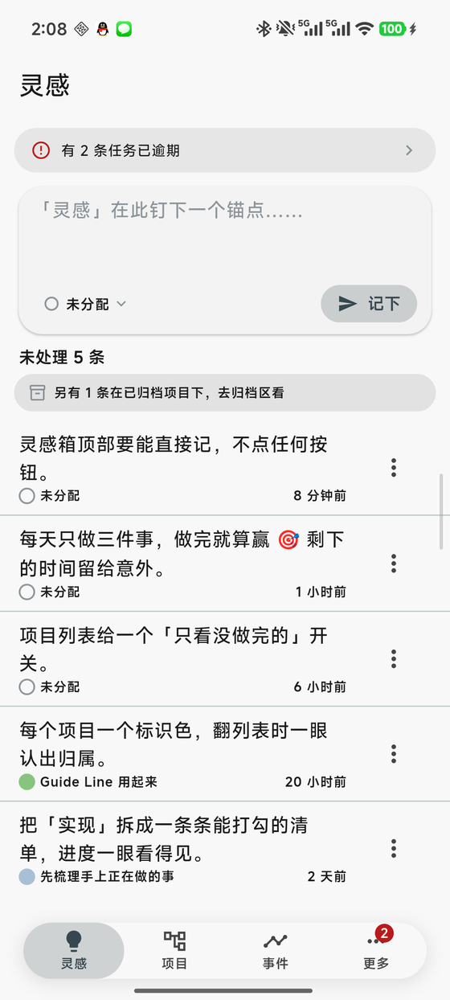
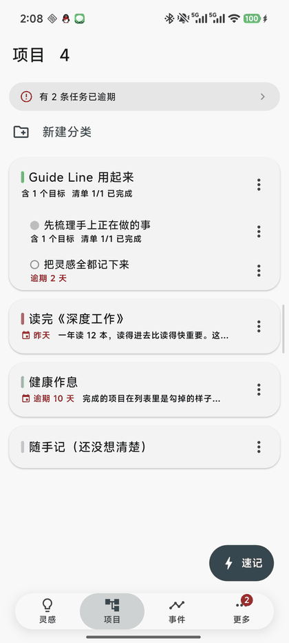
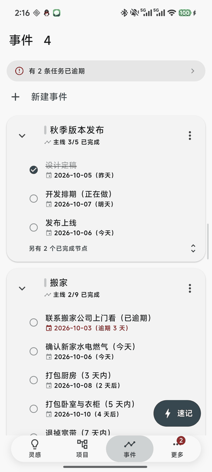
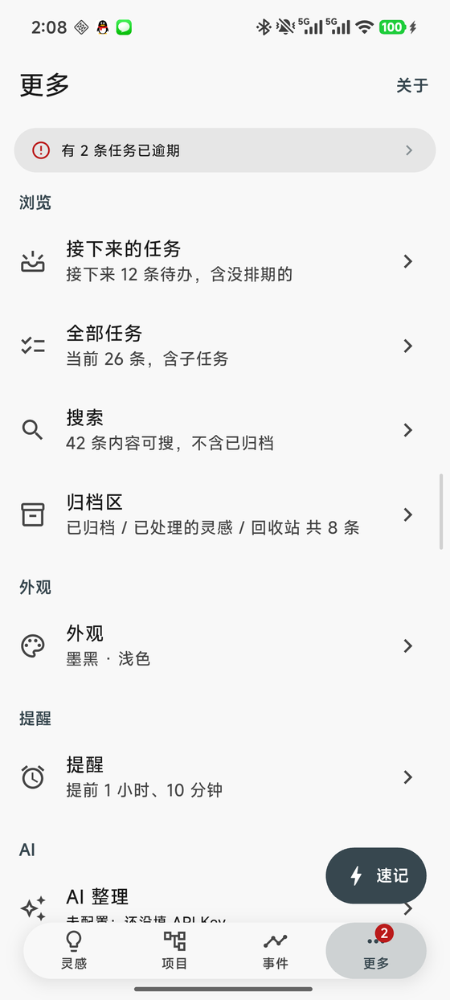
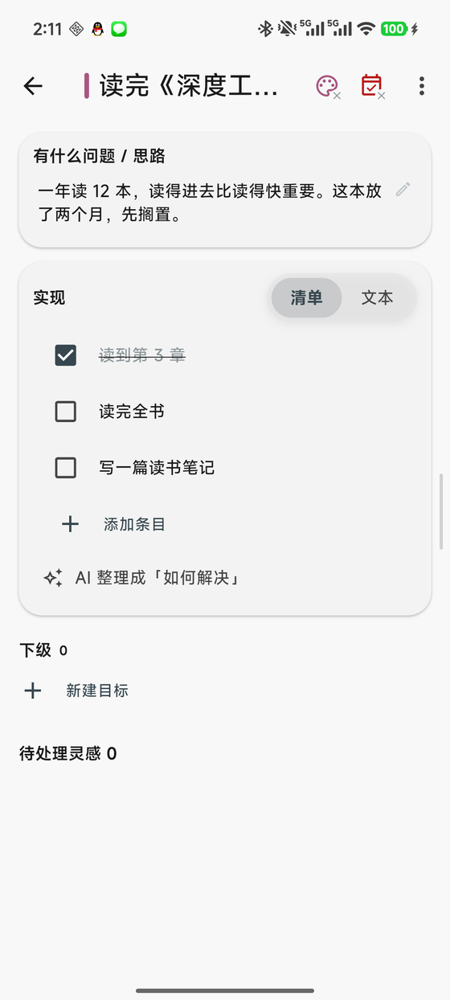
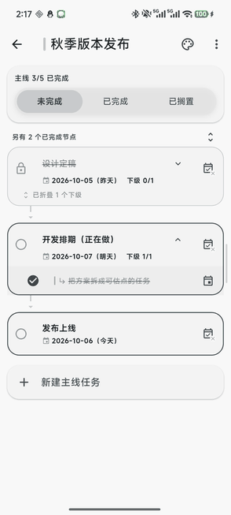
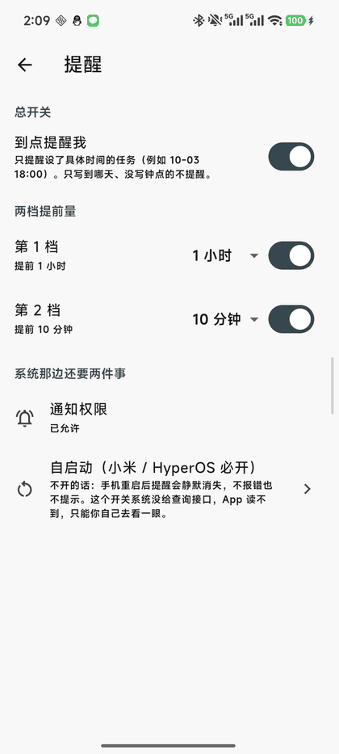

# GuideLine

**本地优先的个人生活管理工具** —— 把「灵感」和「任务线」两条线管清楚。

Android 单机版 + Windows 桌面版。**没有账号、没有服务器、没有推送**：数据是设备上的一份
文件，只留在你自己手里；想留一份在家门外，可以自己填一个 GitHub 私有仓库当备份点。

当前版本 **2.7.8+88** ｜ 变更记录 [`CHANGELOG.md`](CHANGELOG.md) ｜ 安装包 [Releases](https://github.com/maker114/Guide-Line/releases) ｜ 许可 [MIT](LICENSE)

> 📷 **下面截图里的内容全部是演示数据**，由 `tool/demo_seed.dart` 生成
> （10 个项目 / 10 条灵感 / 6 条事件 / 30 条任务），**不含任何真实使用者的内容**。
> 你自己装上之后，打开就是空的，直接开始记。

---

## 它是什么

一个只用自己设备的个人管理工具，两个核心对象：

- **灵感** —— 速记优先：随手扔进输入框，之后再决定分配、合并进项目、或者丢掉
- **项目** —— 一件事的容器：目的、实现清单、相关灵感、日期与标识色，最多三层

外加一条**任务线**：每个「事件」是一条线，主线按顺序往下走，每个节点还能挂子任务（就这两层）。

## 看一眼

<table>
<tr>
<td align="center"> <b>灵感</b> 速记与归类</td>
<td align="center"> <b>项目</b> 分类与目标</td>
<td align="center"> <b>事件</b> 一条线走到底</td>
<td align="center"> <b>更多</b> 其余入口都在这</td>
</tr>
</table>

**同一个 exe / 同一个 App，按窗口宽度换外壳**：窄了是底部四个页签（手机那套），
宽度到 840 以上换成**左侧栏 + 一条整体标题栏**（电脑那套）。两侧的页面与业务规则是同一份，
只有外壳不同。

---

## 灵感：速记 → 归类 → 合并

- **速记优先**：顶部一个输入框，随手写、点「记下」就存住；长按桌面图标也能直接落到这里
- **写的时候就把项目选好**：输入框左下角能选归属（或「不分配」），选中后**不重置** ——
  连着记同一个项目的几条很顺手
- **按项目筛选**：点条目副标题上的项目名，就只看这一个项目的灵感。
  归属只是自己的标记，**不影响归档与完成判定**
- **多选批量处理**：右上「多选」之后可以全选、批量分配、丢弃、删除
- **一键合并进项目**：合并编辑器里的「追加原文」把灵感原文**原封不动**作为新的一行
  接到项目末尾，不自动改写、不润色；合并前原文默认展开，让你看清这次并的是哪几条
- **未分配**的条目右侧是一个灰色空心圆，一眼能认出来

## 项目：分类与目标

- 有下级的算**分类**（只显示名字、色条与汇总），没有下级的算**目标**（全套字段）——
  这样"要做什么"和"怎么归类"不会混在同一个视图里
- **项目树最多三层**，就地展开/收起（收起与展开都是动画，状态记得住）
- 每个项目可以挑一个**标识色**（十来种预设）—— 刻意不放开成任意取色：
  标识色的用途是"在树里一眼认出来"，近色反而更难分
- 分类页的每个下级行上汇总一句 `清单 d/t 已完成`，不显示进度数字

### 项目的「如何解决」：清单 + 正文 + AI 整理

「如何解决」由**两块并存**组成：**清单**是"要做什么"的拆分，**正文**是"整体怎么做"的说明。

- **清单**：可加 / 原地改 / 打勾 / 移动 / 删除。三条边界：顺序就是数组顺序、
  **不参与完成判定**、**与事件里的任务没有任何自动联动**（唯一出口是那条一次性动作「建成任务…」）
- **AI 整理成正文**：把清单交给模型，让它写出一段通顺的说明。这是本应用**唯一会把
  项目内容交给模型服务**的功能，边界逐条写死在设置页里 —— 只发项目名称 / 目的 / 清单条目，
  灵感原文、事件任务、其它项目一律不发；生成结果**先给预览**、可编辑，确认后才写入正文
- **导出交接说明**：把项目生成一份 Markdown（含清单、正文与待处理灵感），
  预览可编辑后导出 `.md`，丢给电脑上的 AI 去实现。任务列表用 GitHub 语法
  `- [x]` / `- [ ]`，粘进 issue 也能直接用

## 事件：一条线走到底

- **一个事件一张卡**：卡头是事件名 + `主线 3/5 已完成` + 当前走到哪个节点，右侧是这一条的动作菜单
- **不用点进去**就能看到这条线走到哪一步了；点卡头或任意节点进详情
- **已完成自动收起**：留下的那一行写着 `另有 N 个已完成节点`，点它就地展开、再点收回

- 一条事件就是**一条链**：节点按顺序往下走（`需求盘点 → 写方案 → 设计定稿 → 开发排期 → 发布上线`）。
  **只有这一种结构** —— 分叉与合流曾经有过，后来删了，因为"并行两条线请开两个事件"更清楚
- **节点下挂子任务**（就两层）；节点的完成状态被未处理的子任务锁着，锁没解开点不动
- **调整先后**：动作面板里的「往上挪一格 / 往下挪一格」；也能**插在指定节点之后**
- 事件本身有**三态**：未完成 / 已完成 / 已搁置

## 全部任务与提醒

- **接下来的任务**：还开着的任务一览，含没排期的
- **全部任务**：分组三选一 —— **按完成度 / 按事件 / 按紧迫度**；
  紧迫度**随日期与时刻由绿转红**，共 7 档：逾期→红、今天→橘红、3 天内→橙、
  5 天内→黄、7 天内→黄绿、7 天后→绿、**没排期→灰**
- **「逾期」看时刻**：写了具体钟点的任务（`2026-10-03 08:30`）**到点就算逾期**，
  不必等到第二天；只写到哪一天的仍旧按天（明天才算逾期）—— 纯日期没有"具体时间点"可言
- 到期日显示成**「绝对日期 + 剩余天数」**：`2026-10-06 16:30（今天）`、`2026-09-30（3 天后）`。
  真的放不下时（窄屏或放大字体）才退成只给「今天」/「3 天后」那半句
- **搜索**跨项目 / 灵感 / 事件 / 任务；**归档区**把已归档、已处理的灵感、回收站收在一起
- 打开应用时顶部会有一条**「有 N 条任务已逾期」**的横条与角标

### 提醒：到点了会告诉你

- **只提醒设了具体时间的任务**（`2026-10-03 18:00`）。只写到哪一天的不提醒 ——
  给"某天要做"编一个具体钟点是编出来的信息
- **一条任务两档**：默认**提前 1 小时**与**提前 10 分钟**，数值可改、每档可单独关掉
- **到点那一刻不提醒**，只提前说；**错过的那一档会合并成一条**立刻补上，
  说的是真实剩余时间（「还有 25 分钟到期」）
- 总开关**默认关**，打开时才申请系统通知权限
- **点通知直接落到那条任务所在的事件**
- ⚠️ **小米 / HyperOS 上必须给 GuideLine 打开「自启动」**：不开的话，应用没在运行时
  系统会拒绝把它唤醒，**通知被静默丢弃**（不报错、也不提示）。原委与实测记录写在
  「更多 → 提醒」页里
- **电脑端不做提醒**

## 界面与外观

- **7 套主题**：默认蓝 / 墨黑 / 松绿 / 陶土 / 梅紫 / 沙金 / 海松 —— 每套只定一个主色，
  其余交给 Material 3 推导，浅色深色都协调；深色 / 亮色可以跟随系统，也可以锁定
- **背景图**（实验性）：从相册选图后拷进应用私有目录，可调强度与模糊；
  还能**从图里取一个主色当主题**（按饱和度加权取样，而不是取"出现最多的颜色" ——
  照片里最多的往往是灰墙和阴影）
- **形状走一套规则**：能点的用胶囊、装东西的用圆角矩形、只有图标的用正圆
- **危险动作不图标化**：行内只留一个图标入口（设 / 改到期日），删除、归档这类留在动作面板里
  —— 图标化会提高误触代价
- 四个页签可以**左右滑动切换**，底栏那个胶囊跟着手指走

## 设计原则

这几条决定了功能长什么样，也是很多"为什么不做"的答案：

| 原则 | 具体表现 |
|---|---|
| **本地优先** | 数据的主体就在设备上，不连任何服务也能用。安全靠"原子替换 + 备份轮转 + 导出"，不靠云端 |
| **不做自动联动** | 灵感并入项目 ≠ 任务；清单全勾完 ≠ 项目完成（项目的收尾方式是归档）。唯一出口是你手动点的那一次动作 |
| **输入一律在页面里直接写** | 新建与重命名都是点一下原地编辑，不弹对话框 |
| **数据安全是一等公民** | 本地备份是主力安全网："清空备份"是不可能完成的操作；GitHub 备份是可选的那第二份，默认关着 |
| **宁可先定口径再动手** | 术语与边界写在 [`docs/spec/`](docs/spec/)，代码、界面文案、测试都照它写 |

## 快速开始

**手机**：从 [Releases](https://github.com/maker114/Guide-Line/releases) 下载
`guideline-*.apk` 装上去 —— 不登录、不联网、不导入任何东西，打开就能用。
**升级安装不会丢数据**（同包名同签名，老数据零迁移）。

**电脑**：下载 `guideline-windows-*.zip`，解压后整个目录一起放着，双击 `guideline.exe`。
不写注册表、不需要安装；数据在 `%LOCALAPPDATA%\GuideLine`，删掉目录就等于彻底卸载。
它与手机端**各存各的**，要搬数据走「导出 / 导入」。

## 不做什么

明确放弃的部分，省得反复讨论：

- **账号与服务器**。FCM 在大陆不可用，也不做账号；到点提醒走的是**本地调度**
  （系统闹钟 + 通知），不经任何服务器
- **双端同步**：手机与电脑各存各的一份数据，不做同步、不做配对。
  唯一能搬数据的是导出 / 导入。电脑端的托盘、全局快捷键、开机自启也都不做
- **桌面小组件**：技术链路验证跑通过，但小米 HyperOS 只收录商店包解析出来的小部件，
  侧载 App 的原生卡片进不了桌面小部件中心 —— 这条路在小米上走不通
- **多语言**：暂时只有中文

## 开发

技术细节（分层、数据与安全、依赖、构建命令、测试规模、怎么改）都搬到了
**[`docs/工程说明.md`](docs/工程说明.md)**；文档总索引也在那一页。

## 许可

[MIT](LICENSE) —— 可以自由使用、修改、分发，只需保留版权声明。
Copyright (c) 2026 Maker114。
